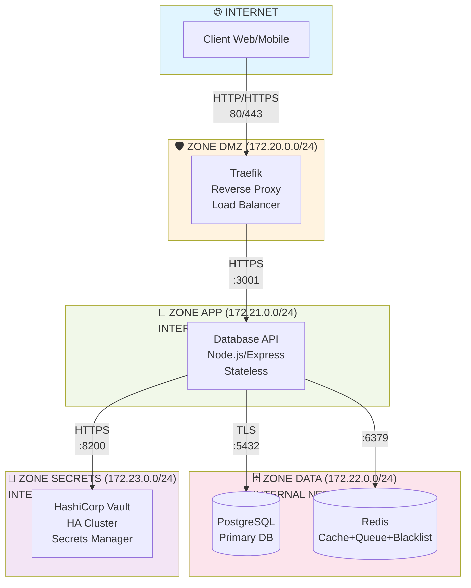
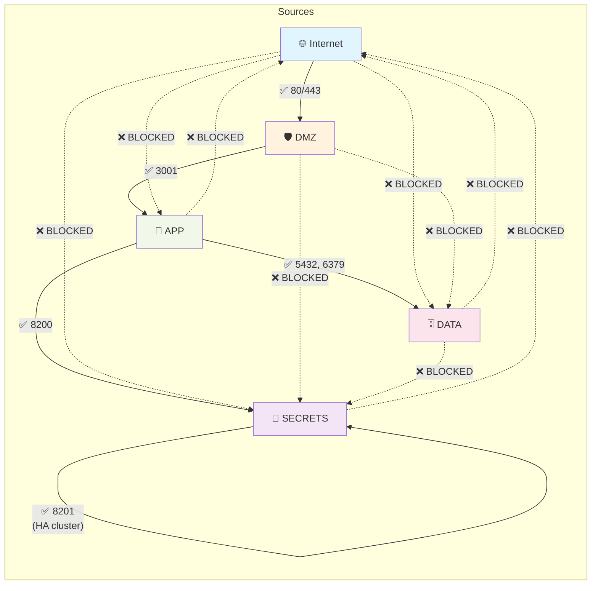
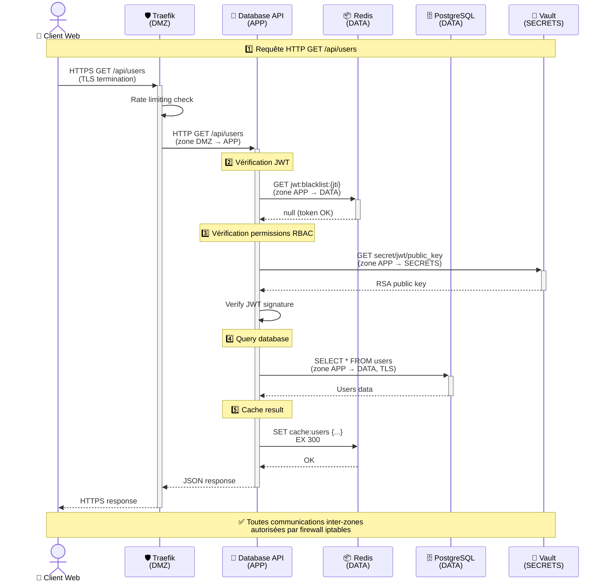
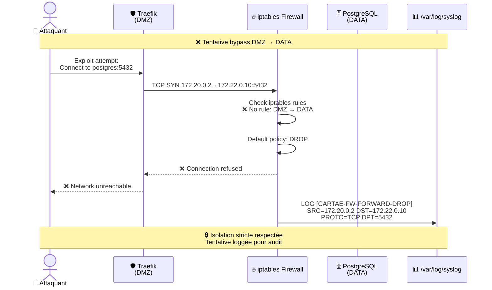
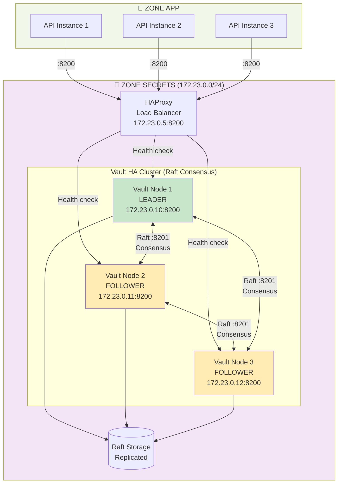
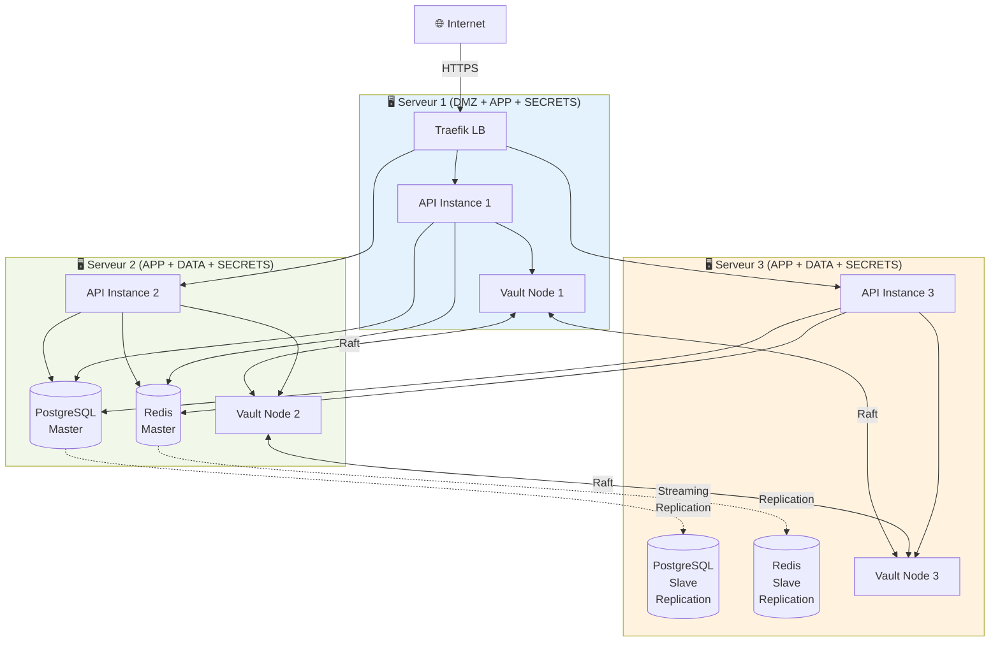

# Cartae - Architecture Réseau (Defense-in-Depth)

Session 81a - Network Segmentation & Firewall

## Vue d'Ensemble

Architecture réseau en 4 zones isolées avec firewall iptables strict (politique DROP par défaut).

## Diagrammes Mermaid

### 1. Architecture Globale (4 Zones)



### 2. Matrice des Flux Autorisés (Firewall Rules)



### 3. Flux de Requête Complète (Client → DB)



### 4. Tentative d'Accès Bloquée (DMZ → PostgreSQL)



### 5. Architecture Vault HA (Mode PROD)



### 6. Déploiement Multi-Serveurs (Mode PROD)



---

```
┌─────────────────────────────────────────────────────────────────┐
│                         INTERNET                                 │
│                        (Public WAN)                              │
└────────────┬────────────────────────────────────────────────────┘
             │ HTTP/HTTPS
             │ (80/443)
             ▼
┌────────────────────────────────────────────────────────────────┐
│  ZONE DMZ (172.20.0.0/24)                                      │
│  ┌──────────────────────────────────────────────┐              │
│  │  Traefik (Reverse Proxy / Load Balancer)    │              │
│  │  - TLS termination                           │              │
│  │  - Rate limiting                             │              │
│  │  - Request routing                           │              │
│  └──────────────────────────────────────────────┘              │
└────────────┬───────────────────────────────────────────────────┘
             │ :3001
             │ (HTTPS en STAGING/PROD)
             ▼
┌────────────────────────────────────────────────────────────────┐
│  ZONE APP (172.21.0.0/24) - INTERNAL NETWORK                   │
│  ┌──────────────────────────────────────────────┐              │
│  │  Database API (Backend Node.js)              │              │
│  │  - Stateless (horizontal scaling ready)      │              │
│  │  - JWT authentication                        │              │
│  │  - RBAC authorization                        │              │
│  │  - Audit logging                             │              │
│  └────┬──────────────┬────────────────┬─────────┘              │
└───────┼──────────────┼────────────────┼────────────────────────┘
        │              │                │
        │ :5432        │ :6379          │ :8200
        ▼              ▼                ▼
┌─────────────────┐ ┌──────────────┐ ┌─────────────────────────┐
│  ZONE DATA      │ │  ZONE DATA   │ │  ZONE SECRETS           │
│  (172.22.0.0/24)│ │              │ │  (172.23.0.0/24)        │
│  INTERNAL       │ │  INTERNAL    │ │  INTERNAL               │
│                 │ │              │ │                         │
│ ┌─────────────┐ │ │ ┌──────────┐ │ │ ┌──────────────────┐   │
│ │ PostgreSQL  │ │ │ │  Redis   │ │ │ │ Vault (HA)       │   │
│ │ - Primary   │ │ │ │ - Cache  │ │ │ │ - Secrets        │   │
│ │ - TLS conn  │ │ │ │ - Queue  │ │ │ │ - RSA keys       │   │
│ │             │ │ │ │ - JWT bl │ │ │ │ - mTLS enabled   │   │
│ └─────────────┘ │ │ └──────────┘ │ │ └──────────────────┘   │
└─────────────────┘ └──────────────┘ └─────────────────────────┘
```

## Zones Réseau

### 1. DMZ (DeMilitarized Zone) - `172.20.0.0/24`

**Objectif:** Exposition Internet sécurisée

**Services:**
- Traefik (reverse proxy / load balancer)

**Règles firewall:**
- ✅ ACCEPT: Internet → DMZ (80/443)
- ✅ ACCEPT: DMZ → APP (:3001)
- ❌ DROP: DMZ → DATA (isolation)
- ❌ DROP: DMZ → SECRETS (isolation)

**Caractéristiques:**
- Seule zone avec accès Internet entrant
- TLS termination (Let's Encrypt)
- Rate limiting (DDoS protection)
- Request routing vers backend

---

### 2. APP (Application Zone) - `172.21.0.0/24`

**Objectif:** Backend stateless (scalable horizontalement)

**Services:**
- Database API (Node.js/Express)

**Règles firewall:**
- ✅ ACCEPT: DMZ → APP (:3001)
- ✅ ACCEPT: APP → DATA (:5432, :6379)
- ✅ ACCEPT: APP → SECRETS (:8200)
- ❌ DROP: APP → Internet (pas de sortie directe)

**Caractéristiques:**
- Réseau INTERNAL (pas d'accès Internet direct)
- Stateless (pas d'état local, tout dans Redis/PostgreSQL)
- Horizontal scaling ready (Traefik load balancer)
- JWT authentication + RBAC

---

### 3. DATA (Database Zone) - `172.22.0.0/24`

**Objectif:** Persistence (bases de données)

**Services:**
- PostgreSQL (primary database)
- Redis (cache DB 0, queue DB 1, JWT blacklist DB 2)

**Règles firewall:**
- ✅ ACCEPT: APP → DATA (:5432, :6379)
- ❌ DROP: DATA → SECRETS (isolation)
- ❌ DROP: DATA → Internet (pas de sortie)
- ❌ DROP: DMZ → DATA (bypass interdit)

**Caractéristiques:**
- Réseau INTERNAL (ultra-isolé)
- TLS encryption PostgreSQL ↔ APP
- Redis avec authentication (STAGING/PROD)
- Backups automatiques (Session 81h)

---

### 4. SECRETS (Secrets Management) - `172.23.0.0/24`

**Objectif:** Gestion des secrets critiques (clés RSA, tokens, API keys)

**Services:**
- HashiCorp Vault (HA cluster en PROD, single-node en DEV/STAGING)

**Règles firewall:**
- ✅ ACCEPT: APP → SECRETS (:8200)
- ✅ ACCEPT: SECRETS ↔ SECRETS (:8201, Raft consensus en HA)
- ❌ DROP: SECRETS → Internet (ultra-isolation)
- ❌ DROP: DMZ → SECRETS (bypass interdit)
- ❌ DROP: DATA → SECRETS (isolation stricte)

**Caractéristiques:**
- Réseau INTERNAL (le plus isolé)
- mTLS entre Vault nodes (HA mode)
- Aucun accès Internet (manual unsealing)
- Audit trail complet (Session 81f)

---

## Matrice d'Accès Réseau

| Source \ Dest | DMZ      | APP      | DATA     | SECRETS  | Internet |
|---------------|----------|----------|----------|----------|----------|
| **Internet**  | ✅ 80/443| ❌       | ❌       | ❌       | N/A      |
| **DMZ**       | N/A      | ✅ 3001  | ❌       | ❌       | ✅       |
| **APP**       | ❌       | N/A      | ✅ 5432  | ✅ 8200  | ❌       |
|               |          |          | ✅ 6379  |          |          |
| **DATA**      | ❌       | ❌       | N/A      | ❌       | ❌       |
| **SECRETS**   | ❌       | ❌       | ❌       | ✅ 8201* | ❌       |

\* Vault cluster internal communication (Raft consensus, mode HA uniquement)

**Légende:**
- ✅ Autorisé (règles iptables explicites)
- ❌ Bloqué (DROP par défaut)

---

## Flux de Données

### 1. Requête HTTP → API → Base de données

```
┌─────────┐   HTTPS   ┌─────────┐   HTTP    ┌──────────┐   TLS    ┌────────────┐
│ Client  │──────────>│ Traefik │──────────>│ API      │─────────>│ PostgreSQL │
│ (Web)   │  80/443   │  (DMZ)  │  :3001    │  (APP)   │  :5432   │   (DATA)   │
└─────────┘           └─────────┘           └──────────┘          └────────────┘
                                                   │
                                                   │ :6379 (Cache check)
                                                   ▼
                                            ┌──────────┐
                                            │  Redis   │
                                            │  (DATA)  │
                                            └──────────┘
```

### 2. API récupère secrets depuis Vault

```
┌──────────┐   HTTPS    ┌────────────────┐
│ API      │───────────>│ Vault          │
│  (APP)   │   :8200    │  (SECRETS)     │
│          │<───────────│ - RSA keys     │
│          │  JWT keys  │ - DB passwords │
└──────────┘            └────────────────┘
```

### 3. Tentative d'accès bloquée (DMZ → PostgreSQL)

```
┌─────────┐    ❌ DROP    ┌────────────┐
│ Traefik │──────X──────>│ PostgreSQL │
│  (DMZ)  │   :5432      │   (DATA)   │
└─────────┘              └────────────┘
         │
         │ iptables: FORWARD DROP (172.20.0.0/24 → 172.22.0.0/24)
         │ Logged: [CARTAE-FW-FORWARD-DROP]
         ▼
┌─────────────────────────┐
│ /var/log/syslog         │
│ [CARTAE-FW-FORWARD-DROP │
│  SRC=172.20.0.2         │
│  DST=172.22.0.10        │
│  PROTO=TCP DPT=5432]    │
└─────────────────────────┘
```

---

## Configuration iptables

### Policies par défaut (Zero-Trust)

```bash
iptables -P INPUT DROP
iptables -P FORWARD DROP
iptables -P OUTPUT DROP
```

### Règles principales

```bash
# Loopback (toujours autorisé)
iptables -A INPUT -i lo -j ACCEPT
iptables -A OUTPUT -o lo -j ACCEPT

# Connexions établies (stateful firewall)
iptables -A INPUT -m conntrack --ctstate ESTABLISHED,RELATED -j ACCEPT
iptables -A FORWARD -m conntrack --ctstate ESTABLISHED,RELATED -j ACCEPT

# Internet → DMZ (HTTP/HTTPS)
iptables -A INPUT -p tcp --dport 80 -j ACCEPT
iptables -A INPUT -p tcp --dport 443 -j ACCEPT

# DMZ → APP (Traefik → API)
iptables -A FORWARD -s 172.20.0.0/24 -d 172.21.0.0/24 -p tcp --dport 3001 -j ACCEPT

# APP → DATA (API → PostgreSQL, Redis)
iptables -A FORWARD -s 172.21.0.0/24 -d 172.22.0.0/24 -p tcp --dport 5432 -j ACCEPT
iptables -A FORWARD -s 172.21.0.0/24 -d 172.22.0.0/24 -p tcp --dport 6379 -j ACCEPT

# APP → SECRETS (API → Vault)
iptables -A FORWARD -s 172.21.0.0/24 -d 172.23.0.0/24 -p tcp --dport 8200 -j ACCEPT

# SECRETS ↔ SECRETS (Vault cluster, HA mode)
iptables -A FORWARD -s 172.23.0.0/24 -d 172.23.0.0/24 -p tcp --dport 8201 -j ACCEPT

# Logging (tentatives bloquées)
iptables -A FORWARD -j LOG --log-prefix "[CARTAE-FW-FORWARD-DROP] " --log-level 4
```

Voir script complet: `infra/scripts/firewall-setup.sh`

---

## Modes de Déploiement

### Mode DEV (développement local)

```yaml
# docker-compose.dev.yml
networks:
  # DMZ, APP, DATA, SECRETS existent mais firewall désactivé
  # Tout est accessible depuis localhost pour debug
```

**Caractéristiques:**
- Firewall désactivé (policy ACCEPT)
- Ports exposés: 5432, 6379, 8200 (debug)
- Pas de TLS
- Vault en mode dev (in-memory, unsealed)
- Mot de passe simple: `changeme123`

**Démarrage:**
```bash
./setup.sh  # Choix 1 = DEV
# OU
docker-compose -f docker-compose.networks.yml \
               -f docker-compose.base.yml \
               -f docker-compose.dev.yml up
```

---

### Mode STAGING (pré-production)

```yaml
# docker-compose.staging.yml
networks:
  app-network:
    internal: true  # Pas d'accès Internet
  data-network:
    internal: true
  secrets-network:
    internal: true
```

**Caractéristiques:**
- Firewall activé (strict)
- TLS Let's Encrypt (staging CA)
- Mots de passe forts (depuis `.env`)
- Vault sealed (manual unseal)
- Identique à PROD (sauf HA)

**Démarrage:**
```bash
./setup.sh  # Choix 2 = STAGING
# OU
docker-compose -f docker-compose.networks.yml \
               -f docker-compose.base.yml \
               -f docker-compose.staging.yml up -d
```

---

### Mode PROD (production multi-serveur)

**Caractéristiques:**
- Firewall activé (strict)
- TLS Let's Encrypt (production CA)
- Vault HA cluster (3 nodes + HAProxy)
- API multi-instances (Traefik load balancer)
- Redis Sentinel (HA)
- PostgreSQL replication (master-slave)

**Architecture:**
- Serveur 1: Traefik, API instance 1, Vault node 1
- Serveur 2: API instance 2, PostgreSQL master, Redis master, Vault node 2
- Serveur 3: API instance 3, PostgreSQL slave, Redis slave, Vault node 3

Voir Session 81d (Vault HA) et Session 81e (API Stateless) pour détails.

---

## Tests d'Isolation

Script de tests automatique: `infra/tests/test-network-isolation.sh`

**Tests effectués:**
1. ❌ DMZ → PostgreSQL (doit être bloqué)
2. ❌ DMZ → Redis (doit être bloqué)
3. ❌ DMZ → Vault (doit être bloqué)
4. ✅ APP → PostgreSQL (doit être autorisé)
5. ✅ APP → Redis (doit être autorisé)
6. ✅ APP → Vault (doit être autorisé)
7. ❌ PostgreSQL → Vault (doit être bloqué)
8. ❌ Redis → Vault (doit être bloqué)
9. ❌ Vault → Internet (doit être bloqué)
10. ✅ Containers dans bonnes zones IP
11. ✅ Réseaux marqués `internal` (sauf DMZ)

**Exécution:**
```bash
cd infra/tests
./test-network-isolation.sh

# Résultat attendu:
# ✅ TOUS LES TESTS PASSENT - Isolation réseau correcte
```

---

## Monitoring (Session 81g)

### Métriques Prometheus

```yaml
# Exposition métriques
- traefik_entrypoint_requests_total
- traefik_backend_requests_duration_seconds
- node_network_transmit_bytes_total (par interface)
- iptables_packets_dropped_total
```

### Logs

```bash
# Logs firewall (tentatives bloquées)
tail -f /var/log/syslog | grep CARTAE-FW

# Logs Traefik (accès HTTP)
tail -f /var/log/traefik/access.log
```

### Dashboards Grafana

- Dashboard "Network Security"
  - Tentatives d'accès bloquées (par zone source/dest)
  - Règles firewall actives
  - Trafic inter-zones (bande passante)

---

## Migration vers Cloud (futur)

L'architecture réseau fonctionne identiquement en cloud:

### AWS

```
Internet → ALB (DMZ) → ECS Fargate (APP) → RDS (DATA) + ElastiCache (DATA)
                                          → Secrets Manager (SECRETS)
```

**Mapping:**
- DMZ → ALB (Application Load Balancer) dans subnet public
- APP → ECS Fargate dans subnet privé
- DATA → RDS + ElastiCache dans subnet privé
- SECRETS → AWS Secrets Manager (service managé)

**Security Groups (équivalent iptables):**
- SG-DMZ: Allow 80/443 from 0.0.0.0/0
- SG-APP: Allow 3001 from SG-DMZ
- SG-DATA: Allow 5432/6379 from SG-APP
- SG-SECRETS: Allow 443 from SG-APP

---

### GCP

```
Internet → Cloud Load Balancer (DMZ) → Cloud Run (APP) → Cloud SQL (DATA) + Memorystore (DATA)
                                                        → Secret Manager (SECRETS)
```

---

### Azure

```
Internet → App Gateway (DMZ) → AKS (APP) → Azure Database (DATA) + Redis Cache (DATA)
                                         → Key Vault (SECRETS)
```

---

## Sécurité Additionnelle (Sessions futures)

- **Session 81b:** TLS/mTLS end-to-end (chiffrement inter-zones)
- **Session 81g:** IDS/IPS (Suricata pour détecter attaques)
- **Session 81h:** Backups chiffrés (AES-256-GCM)

---

## Références

- Docker Networks: https://docs.docker.com/network/
- iptables: https://netfilter.org/documentation/
- Zero-Trust Network: https://www.nist.gov/publications/zero-trust-architecture
- Defense-in-Depth: https://owasp.org/www-community/Defense_in_Depth

---

**Auteur:** Cartae Security Team
**Date:** 2025-11-15
**Version:** 1.0.0
**Session:** 81a - Network Segmentation & Firewall
